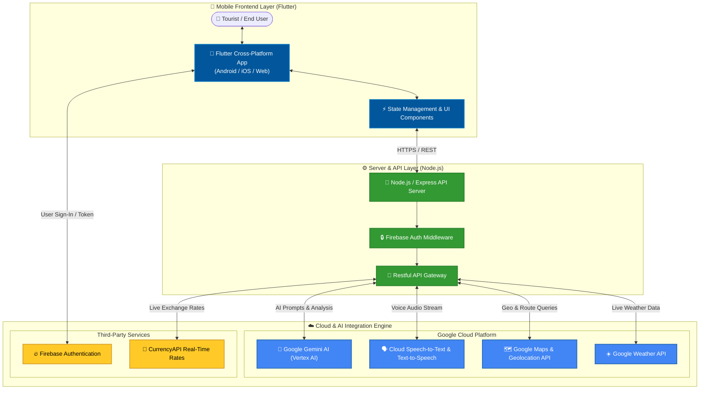

<div align="center">

  <br />
  
  

  # 🧭 PathFinder AI
  ### **Your Intelligent Multilingual AI Tourist Guide & Smart Travel Companion**

  <p align="center">
    <b>Empowering travelers to explore the world without language barriers, price scams, or transit confusion.</b>
    <br />
    <i>Powered by Google Gemini AI, Vertex AI, Speech Services & Flutter</i>
  </p>

  <p align="center">
    <a href="#-key-features"><b>Explore Features</b></a> •
    <a href="#-system-architecture"><b>Architecture</b></a> •
    <a href="#-quick-start-guide"><b>Quick Start</b></a> •
    <a href="#-tech-stack"><b>Tech Stack</b></a> •
    <a href="#-team-googleists"><b>The Team</b></a>
  </p>

  <br />

  <!-- Shield Badges -->
  [](https://deepmind.google/technologies/gemini/)
  [](https://flutter.dev)
  [](https://nodejs.org/)
  [](https://firebase.google.com/)
  [](LICENSE)
  [](https://flutter.dev)

  <br />
  <br />

  ---

</div>

<br />

## 📌 Table of Contents

- [✨ Overview](#-overview)
- [📸 Key Features](#-key-features)
- [🏗️ System Architecture](#-system-architecture)
- [💻 Tech Stack & Integrations](#-tech-stack--integrations)
- [📁 Project Directory Structure](#-project-directory-structure)
- [🚀 Quick Start Guide](#-quick-start-guide)
  - [Prerequisites](#prerequisites)
  - [Backend Setup](#1%EF%B8%8F%E2%83%A3-backend-setup-nodejs)
  - [Frontend Setup](#2%EF%B8%8F%E2%83%A3-frontend-setup-flutter)
- [⚙️ Environment Variables](#%EF%B8%8F-environment-variables)
- [👥 Team GOOGLEISTS](#-team-googleists)
- [📄 License & Acknowledgments](#-license--acknowledgments)

<br />

---

## ✨ Overview

**PathFinder AI** is a next-generation travel application designed to solve the biggest pain points tourists face abroad: **language barriers, inflated pricing scams, navigation confusion, and solo travel isolation**.

By harnessing **Google Gemini on Vertex AI**, **Google Cloud Speech Services**, and real-time financial APIs, PathFinder AI acts as a 24/7 personal tour guide, translator, financial advisor, and navigation assistant right in your pocket.

<br />

---

## 📸 Key Features

<table width="100%">
  <tr>
    <td width="50%" valign="top">
      <div align="center">
        
        <h3>🎙️ Real-Time Voice & Text Translation</h3>
      </div>
      <ul>
        <li><b>Speech-to-Speech Engine:</b> Instant, natural voice translation between tourist and locals.</li>
        <li><b>Context-Aware AI:</b> Recognizes local dialects, regional slang, and conversational context.</li>
        <li><b>Multilingual Support:</b> Overcomes communication barriers with taxi drivers, vendors, and emergency contacts.</li>
      </ul>
    </td>
    <td width="50%" valign="top">
      <div align="center">
        
        <h3>🛡️ Scam Prevention & Price Advisor</h3>
      </div>
      <ul>
        <li><b>Real-Time Price Checker:</b> Evaluates item or taxi service quotes against live market averages.</li>
        <li><b>Fraud & Inflation Alerts:</b> Warns tourists immediately if a price is suspiciously high.</li>
        <li><b>Fair Price Benchmarks:</b> Displays accurate price ranges for food, transport, activities, and souvenirs.</li>
      </ul>
    </td>
  </tr>
  <tr>
    <td width="50%" valign="top">
      <div align="center">
        
        <h3>🎯 Personal Guide & Itineraries</h3>
      </div>
      <ul>
        <li><b>Budget-Tailored Plans:</b> Recommends activities, dining, and hidden gems custom to your budget.</li>
        <li><b>Cultural Insights & Etiquette:</b> Informs users of local customs, tipping rules, and appropriate behavior.</li>
        <li><b>Weather-Adaptive Itineraries:</b> Dynamically re-routes activities based on real-time weather forecasts.</li>
      </ul>
    </td>
    <td width="50%" valign="top">
      <div align="center">
        
        <h3>🚌 Smart Navigation & Companion Match</h3>
      </div>
      <ul>
        <li><b>Live Transit Routing:</b> Multimodal navigation across public transit, rideshares, and walking.</li>
        <li><b>Cost & Time Optimization:</b> Displays transparent fare estimates and fastest connections.</li>
        <li><b>Traveler Companion Match:</b> Safely connects solo travelers looking to explore sights together.</li>
      </ul>
    </td>
  </tr>
</table>

<br />

---

## 🏗️ System Architecture



<br />

---

## 💻 Tech Stack & Integrations

| Domain | Technology / Service | Description & Purpose |
| :--- | :--- | :--- |
| **Frontend Framework** |   | Cross-platform high-performance UI framework for Android, iOS & Web |
| **Backend Runtime** |   | Lightweight RESTful microservice backend handling business logic |
| **Core AI Model** |  | Intelligence engine for price validation, translation, & itineraries |
| **Authentication** |  | Secure user authentication, OAuth logins, and session management |
| **Voice Processing** |  | Real-time speech conversion and audio synthesis for voice chat |
| **Location & Maps** |  | Geocoding, place lookup, distance matrix, and route calculation |
| **Currency Rates** | `CurrencyAPI` | Real-time international exchange rate calculations |

<br />

---

## 📁 Project Directory Structure

```text
PathFinder-AI/
├── 📁 back/                   # Node.js Express Backend Service
│   ├── 📁 controllers/        # Route logic & AI processing controllers
│   ├── 📁 routes/             # RESTful API endpoints
│   ├── 📁 services/           # Gemini AI, Maps & Speech integrations
│   ├── 📄 package.json        # Node dependencies & scripts
│   └── 📄 server.js           # Server entry point
│
├── 📁 front/                  # Flutter Mobile & Web Application
│   ├── 📁 lib/                # Dart source code
│   │   ├── 📁 screens/        # UI Views & App screens
│   │   ├── 📁 services/       # API clients & authentication
│   │   └── 📄 main.dart       # Flutter app entry point
│   ├── 📁 assets/             # Images, icons & static resources
│   └── 📄 pubspec.yaml        # Flutter packages & configurations
│
└── 📄 README.md               # Project documentation
```

<br />

---

## 🚀 Quick Start Guide

### Prerequisites

Ensure you have the following installed on your machine before running the project:

- [Flutter SDK](https://docs.flutter.dev/get-started/install) (v3.0 or higher)
- [Node.js](https://nodejs.org/) (v18.0 or higher) + `npm`
- [Git](https://git-scm.com/)
- An Android Studio setup / Android Emulator or physical test device

---

### 1️⃣ Backend Setup (Node.js)

```bash
# 1. Clone the repository (if not already done)
git clone https://github.com/Ramaalodat/PathFinder-AI.git
cd PathFinder-AI

# 2. Navigate into the backend directory
cd back

# 3. Install project dependencies
npm install

# 4. Configure environment variables (create a .env file)
cp .env.example .env

# 5. Start the backend development server
npm run dev
```

*The backend server will run by default at `http://localhost:5000`.*

---

### 2️⃣ Frontend Setup (Flutter)

```bash
# 1. Open a new terminal and navigate to the frontend directory
cd front

# 2. Fetch Flutter package dependencies
flutter pub get

# 3. Run static code analysis to verify setup
flutter analyze

# 4. Launch app on connected Android emulator or device
flutter run
```

<br />

---

## ⚙️ Environment Variables

Create a `.env` file in the `back/` folder with the following variables:

```env
PORT=5000
NODE_ENV=development

# Google AI & Cloud API Keys
GEMINI_API_KEY=your_google_gemini_api_key_here
GOOGLE_MAPS_API_KEY=your_google_maps_api_key_here

# Firebase Configuration
FIREBASE_PROJECT_ID=your_firebase_project_id
FIREBASE_CLIENT_EMAIL=your_firebase_client_email
FIREBASE_PRIVATE_KEY=your_firebase_private_key

# Third-Party API Keys
CURRENCY_API_KEY=your_currency_api_key_here
```

<br />

---

## 👥 Team GOOGLEISTS

<div align="center">

| Avatar | Developer | Role | Badges | GitHub Profile |
| :---: | :--- | :--- | :---: | :---: |
|  | **Mohammad Al-Majali** | Backend Lead | `Node.js` `Gemini AI` | [](https://github.com/MavisVermie) |
|  | **Marah Al-Qunbor** | Backend Engineer | `Express.js` `APIs` | [](https://github.com/MarahYousef01) |
|  | **Rama Al-Odat** | Frontend Lead | `Flutter` `UI/UX` | [](https://github.com/Ramaalodat) |
|  | **Mohammad Al-Ali** | Frontend Engineer | `Dart` `Mobile` | [](#) |

</div>

<br />

---

<div align="center">

  
  <br />
  <b>Designed with ❤️ by Team GOOGLEISTS</b>
  <br />
  <i>Safe & Intelligent Travels with PathFinder AI! 🌍✨</i>

  <br /><br />

  <a href="#-pathfinder-ai"><b>⬆️ Back to Top</b></a>

</div>


