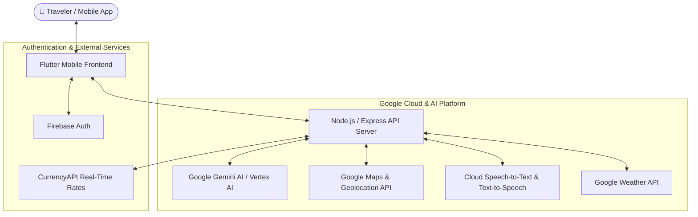

<div align="center">

  # 🧭 PathFinder AI
  ### *Your Intelligent Multilingual AI Tourist Guide & Travel Companion*

  [](https://deepmind.google/technologies/gemini/)
  [](https://flutter.dev)
  [](https://nodejs.org/)
  [](https://firebase.google.com/)
  [](https://flutter.dev)

  ---

  <p align="center">
    <b>PathFinder AI</b> empowers tourists to navigate foreign destinations with confidence. Powered by Google Gemini on Vertex AI, it combines real-time voice translation, scam detection, local transport routing, and social travel matching into a seamless mobile experience.
  </p>

</div>

---

## 📸 Key Highlights & Features

<table>
  <tr>
    <td width="50%">
      <h3>🎙️ Real-Time Voice & Text Translation</h3>
      <ul>
        <li><b>Speech-to-Speech:</b> Instant voice-to-voice translation for smooth local conversations.</li>
        <li><b>Multilingual Support:</b> Overcomes language barriers with drivers, vendors, and locals.</li>
        <li><b>Context-Aware:</b> Understands travel slang and localized phrasing.</li>
      </ul>
    </td>
    <td width="50%">
      <h3>🛡️ Scam Prevention & Price Advisor</h3>
      <ul>
        <li><b>Smart Price Check:</b> Compares local item/taxi prices against market averages.</li>
        <li><b>Fraud Alert:</b> Warns users instantly if prices are inflated or suspicious.</li>
        <li><b>Fair Price Guide:</b> Gives optimal price ranges for food, transport, and souvenirs.</li>
      </ul>
    </td>
  </tr>
  <tr>
    <td width="50%">
      <h3>🎯 Personalized Recommendations</h3>
      <ul>
        <li><b>Budget-Tailored:</b> Recommends attractions, dining, and activities based on budget.</li>
        <li><b>Cultural Etiquette:</b> Guidance on local customs, do's, and don'ts.</li>
        <li><b>Dynamic Itineraries:</b> Adaptive travel plans according to real-time weather and location.</li>
      </ul>
    </td>
    <td width="50%">
      <h3>🚌 Smart Transportation & Social Matching</h3>
      <ul>
        <li><b>Live Navigation:</b> Optimal public transit, walking, and rideshare directions.</li>
        <li><b>Traffic & Cost Optimization:</b> Displays ticket estimates and fastest routes.</li>
        <li><b>Traveler Companion Match:</b> Connects solo travelers to explore nearby sights together.</li>
      </ul>
    </td>
  </tr>
</table>

---

## 🏗️ Architecture & Tech Stack



### 💻 Technologies & APIs

| Layer | Stack / Tool | Description |
| :--- | :--- | :--- |
| **Frontend** |   | Cross-platform mobile UI for Android & Web |
| **Backend** |   | RESTful API server handling business logic & integrations |
| **AI Engine** |  | Core intelligence for recommendations, pricing, & translation |
| **Cloud Services** |   | Auth, Speech-to-Text, Text-to-Speech, Maps, GeoCoding, Weather |
| **Financial API** | `CurrencyAPI` | Live foreign currency exchange & conversion calculation |

---

## 🚀 Quick Start Guide

### Prerequisites
* [Flutter SDK](https://docs.flutter.dev/get-started/install) (v3.0+)
* [Node.js](https://nodejs.org/) (v18.0+)
* Android Studio / Android Emulator or physical device

---

### 1️⃣ Frontend Setup (Flutter)

```bash
# Navigate to the frontend workspace
cd front

# Get flutter dependencies
flutter pub get

# Run static analysis
flutter analyze

# Run on connected Android device/emulator
flutter run
```

---

### 2️⃣ Backend Setup (Node.js)

```bash
# Open a new terminal and navigate to the backend directory
cd back

# Install package dependencies
npm install

# Start development server
npm run dev
```

---

## 👥 Meet Team GOOGLEISTS

<div align="center">

| Developer | Role | Profile |
| :--- | :--- | :--- |
| **Mohammad Al-Majali** | Backend Lead | [](https://github.com/MavisVermie) |
| **Marah Al-Qunbor** | Backend Engineer | [](https://github.com/MarahYousef01/) |
| **Rama Al-Odat** | Frontend Lead | [](https://github.com/Ramaalodat) |
| **Mohammad Al-Ali** | Frontend Engineer | [](#) |

</div>

---

<div align="center">

  <b>Made with ❤️ by Team GOOGLEISTS</b><br>
  *Happy Travels with PathFinder AI! 🌍✈️*

</div>

